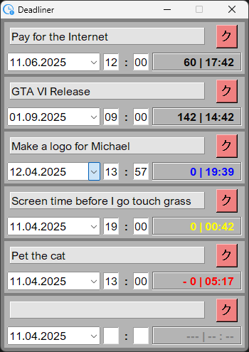

# DeadLiner  
  
#### Deadliner is a simple program for tracking your deadlines. Made with Tkinter in Python.  
<em>made for personal use</em>

## Tips:  
Quantinty of time trackers can be changed by passing an argument. 3 by default. Up to 10.  
`start ./Deadliner.exe 3`

## Compile command:  
`pyinstaller --onefile --hidden-import=babel.numbers src/Deadliner.py --windowed`
